# MongoDB Queries

This repository contains MongoDB query practice examples with screenshots.

## Query 1
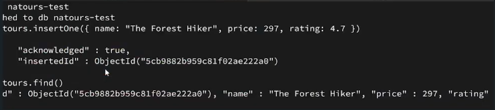

## Query 2
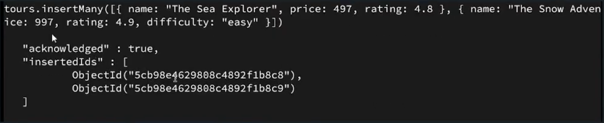

## Query 3
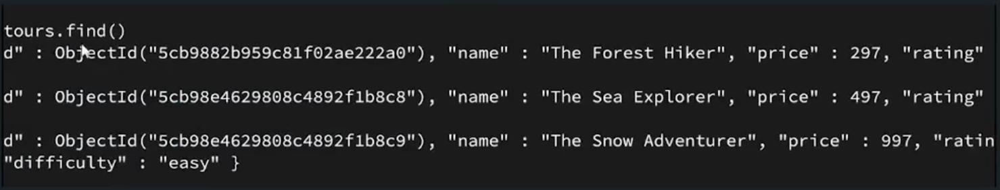

## Query 4
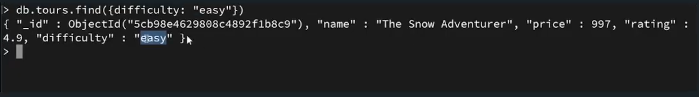

## Query 5
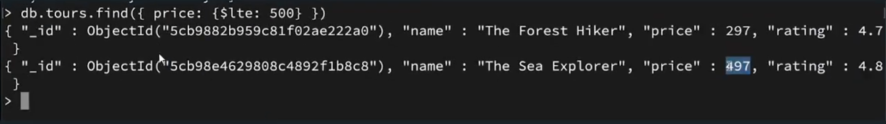

## Query 6
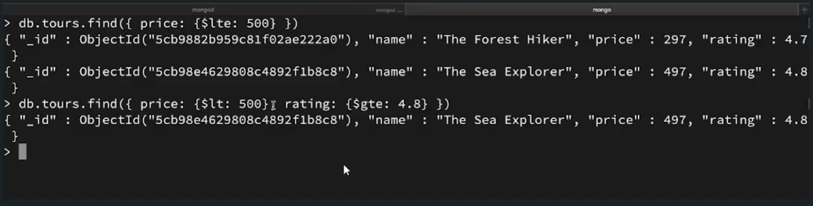

## Query 7
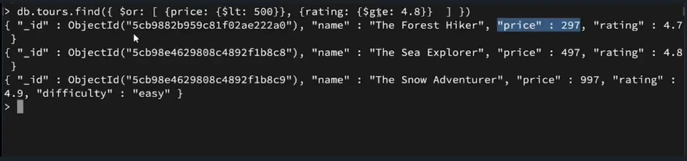

## Query 8
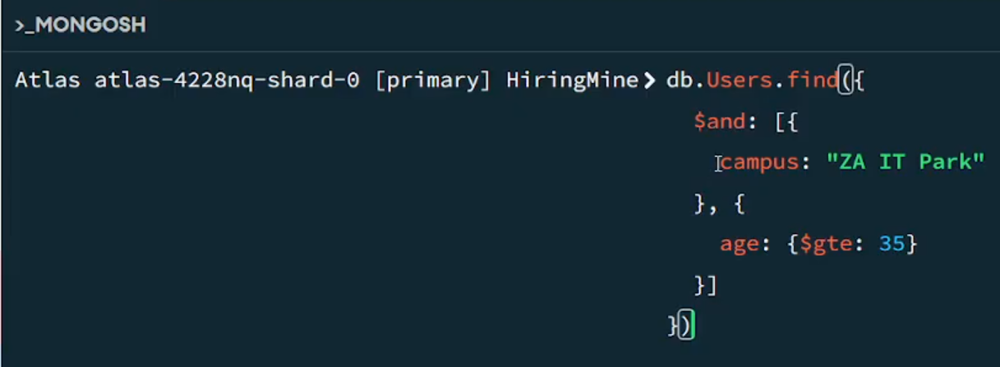

## Query 9
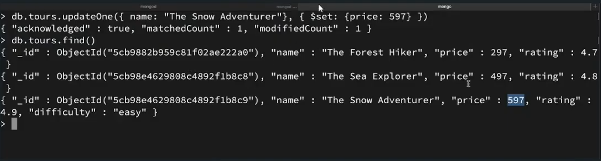

## Query 10
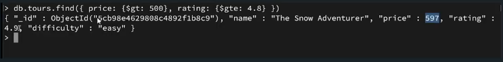

## Query 11
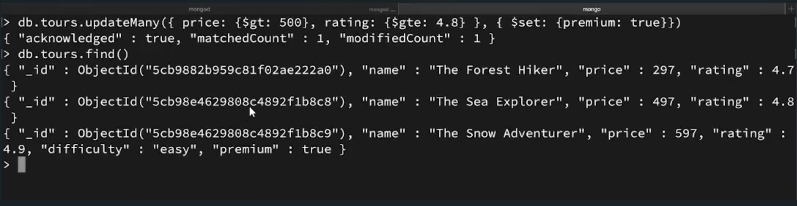

## Query 12
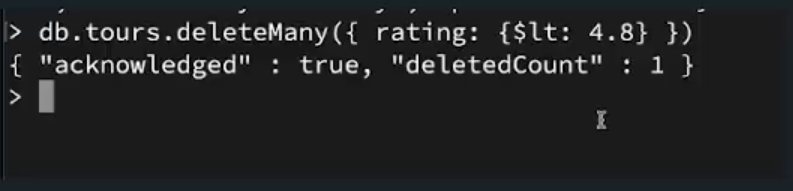

## Query 13
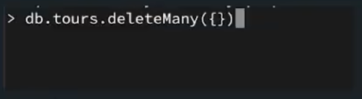

## Query 14
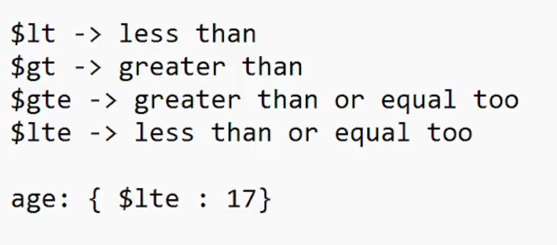